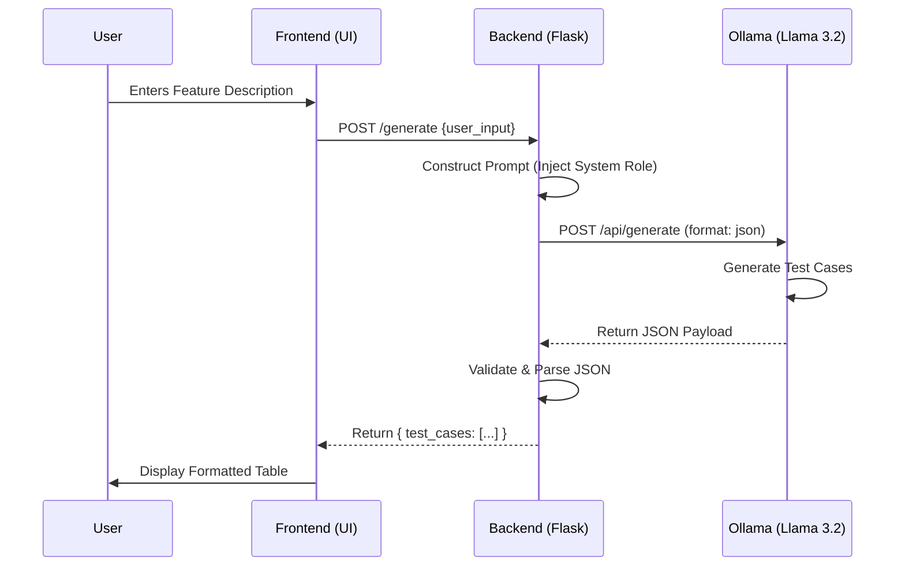

# AI Feature To Test Case Generator 🚀

**A Local LLM-powered tool that converts feature descriptions into structured QA Test Cases.**

This project uses **Ollama** (specifically the `llama3.2:3b` model) running locally to generate detailed, structured test cases from simple user inputs. It features a modern, responsive Chat UI and a lightweight Flask backend.

## 🌟 Features

- **Local & Private:** Runs entirely on your machine using Ollama. No data leaves your network.
- **Structured Output:** Generates test cases in a strict JSON format, presented in a clean table.
- **Modern UI:** Dark-mode, responsive chat interface built with Vanilla JS and CSS.
- **Customizable:** Easily modify the system prompt in `app.py` to change the test case format.

## 🏗️ Architecture

### System Flow
```mermaid
graph TD
    User[User] -->|Types Feature| UI[Web Interface \n(HTML/JS)]
    UI -->|POST /generate| Backend[Flask Backend \n(Python)]
    Backend -->|Prompts| Ollama[Ollama API \n(Localhost:11434)]
    Ollama -->|Inference| Model[Llama 3.2:3b]
    Model -->|JSON Response| Ollama
    Ollama -->|Raw JSON| Backend
    Backend -->|Validated JSON| UI
    UI -->|Render Table| User
```

### Sequence Diagram


## 🛠️ Prerequisites

1.  **Python 3.x** installed.
2.  **Ollama** installed and running.
    - Download from [ollama.com](https://ollama.com).
    - Pull the model: `ollama pull llama3.2:3b`

## 📦 Installation

1.  Clone this repository:
    ```bash
    git clone https://github.com/YOUR_USERNAME/AIFeatureToTestCaseGenerator.git
    cd AIFeatureToTestCaseGenerator
    ```

2.  Install dependencies:
    ```bash
    pip install flask requests
    ```

## 🚀 Usage

1.  **Start Ollama:**
    Ensure Ollama is running in the background.

2.  **Run the Application:**
    ```bash
    python app.py
    ```

3.  **Open in Browser:**
    Navigate to `http://127.0.0.1:5000`

4.  **Generate Test Cases:**
    - Type a feature description (e.g., *"Login page with 2FA"*).
    - Click Send.
    - View the generated test cases in the table.

## 📂 Project Structure

- `app.py`: Flask backend handling API requests and Ollama communication.
- `templates/index.html`: Main chat interface.
- `static/`: CSS styles and JavaScript logic.
- `gemini.md`: Project documentation and schema definitions.
- `architecture/`: Technical SOPs.

## 🤝 Contributing

Feel free to open issues or submit PRs if you have ideas for improvements!

## 📄 License

MIT License
